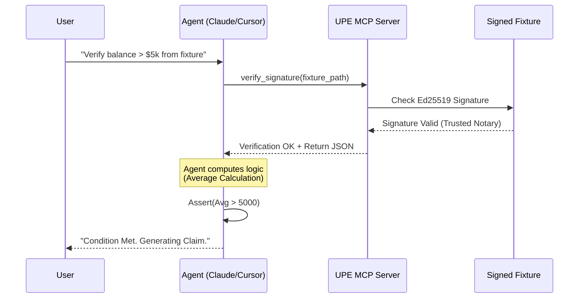
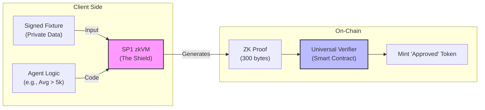

# Prototype Vision: The Universal Privacy Engine

> **Status:** Forward-Looking Product Specification  
> **Target Timeline:** 6-12 Months  
> **Foundation:** Builds on the current "Signed TLS Fixtures (STLOP)" Alpha.

## 1. Introduction

**Where We Are (Phase 1): The Secure Pipe**  
We have successfully built the **Authenticated Data Layer**. The current Alpha release provides a rugged, signature-enforced pipeline (`HttpProvider` + `RecordedTlsProof`) that allows developers to ingest data from any HTTPS source and verify its origin using a Trusted Notary anchor. We know *where* the data came from and that it hasn't been tampered with.

**Where We Are Going: The Brain & The Shield**  
The next evolution transforms this passive verifiable data into active, verifiable *intelligence*.
1.  **Phase 2 (The Brain):** We enable AI Agents to "read" this signed data using the Model Context Protocol (MCP), performing complex logic on authenticated banking/identity records.
2.  **Phase 3 (The Shield):** We wrap that agentic logic into a Zero-Knowledge Proof (SP1), allowing the result to be verified on-chain without ever revealing the private user data.

---

## 2. Phase 2: The Intelligence Layer (Agentic Workflow)

In this phase, the Universal Privacy Engine becomes a tool for AI Agents. We expose the verification logic as an **MCP Server**, allowing LLMs (like Claude or Cursor) to natively interact with signed private data.

### The User Experience
Imagine a developer or a financial agent using an LLM-powered IDE.

> **User Prompt:**  
> "Check my signed `bank_statement.json`. If my average monthly balance is over $5,000, generate a 'Pre-Approved' claim file for the RWA protocol."

### The Architecture
1.  **MCP Server Integration**: The `upe` CLI exposes tools like `get_signed_data(url)` and `verify_signature(fixture)`.
2.  **Trust Anchor Enforcement**: Before the LLM effectively "reads" the data for reasoning, the MCP tool strictly enforces the Ed25519 signature check against the Local Notary.
3.  **LLM Reasoning**: The Agent parses the authenticated JSON, computes the math (e.g., averaging 12 months of fields), and asserts the business logic.
4.  **Output**: The Agent produces a result that is *conceptually* verified (by the signature), ready for the next phase.

### Visual Flow (Mermaid)

---

## 3. Phase 3: The Universal Verifier (SP1 Integration)

Phase 2 proves the logic to the *user*. Phase 3 proves it to the *blockchain*. We take the exact logic defined by the Agent and compile it into a ZK Circuit using SP1.

### The "Privacy Envelope"
We treat the SP1 zkVM as a cryptographic envelope.
- **Inside the Envelope**: The private data (Bank Statement) and the business logic (Average Calc).
- **Outside the Envelope**: The specific result ("Approved") and a tiny, constant-size proof.

### The Flow
1.  **Input**:
    - **Private**: The `metadata.json` (Signed STLOP) + `response_body.json`.
    - **Public**: The Business Logic (Rust Guest Code).
2.  **The Circuit (Guest Program)**:
    - **Step A**: The Guest validates the Notary's Ed25519 signature (inside ZK).
    - **Step B**: The Guest parses the JSON and runs the math.
    - **Step C**: The Guest commits the result ("True") to the public output.
3.  **Output**: A ~300-byte Groth16 proof.
4.  **Destination**: This proof is sent to a Smart Contract (Universal Verifier) on **Solana** or **Stellar**.

### The Destination
- **Solana**: An Anchor program verifies the Groth16 proof and mints a `PreApproved` SPL Token.
- **Stellar**: A Soroban contract verifies the proof and updates the user's compliance ledger.

### Visual Flow (Mermaid)

---

## Conclusion

The Universal Privacy Engine evolves from a **Data Fetcher** (Phase 1) to an **Intelligent Reasoner** (Phase 2) and finally to a **Cryptographic Truth Machine** (Phase 3). This roadmap delivers on the promise of bringing off-chain intelligence to on-chain assets without compromising user privacy.
