# System Flow - Universal Privacy Engine

## Overview

This document provides a detailed sequence diagram of the Universal Privacy Engine's end-to-end workflow, from user input to on-chain verification.

---

## Complete System Flow

```mermaid
sequenceDiagram
    participant User as 👤 User
    participant Cursor as 🖥️ Cursor/Claude
    participant MCP as 🔌 MCP Server
    participant Agent as 🤖 VeriVault Agent
    participant Extractor as 📄 Structured Extractor
    participant Validator as ✅ Schema Validator
    participant Host as 🏠 SP1 Host (Prover)
    participant Guest as 🔐 SP1 Guest (RISC-V)
    participant Groth16 as 🔄 Groth16 Wrapper
    participant Audit as 📝 ZK Audit Trail
    participant Orchestrator as 🎯 Chain Orchestrator
    participant Solana as ⚡ Solana Verifier
    participant Stellar as ⭐ Stellar Verifier
    participant Mantra as 🕉️ Mantra Verifier

    %% Phase 1: User Input & Extraction
    User->>Cursor: "Prove I have $50k for Mantra RWA"
    Cursor->>MCP: Natural language request
    MCP->>Agent: extract_claim(bank_statement, threshold)
    
    Agent->>Extractor: Parse raw data
    Note over Extractor: 1. Sanitize PII<br/>2. Extract balance<br/>3. Hash source data
    Extractor->>Extractor: Regex/LLM extraction
    Extractor-->>Agent: ExtractionResult {claim, confidence: 0.95}
    
    Agent->>Validator: Validate RwaClaim
    Note over Validator: 1. Balance > 0<br/>2. Threshold ≤ Balance<br/>3. Check placeholders
    Validator-->>Agent: ValidationResult {is_valid: true}
    
    Agent->>Audit: Log extraction
    Note over Audit: Hash: SHA256(input)<br/>Action: ExtractClaim<br/>Confidence: 0.95
    
    Agent-->>MCP: {claim, confidence, warnings}
    MCP-->>Cursor: Structured claim data
    Cursor-->>User: ✅ Claim extracted (95% confidence)

    %% Phase 2: Proof Generation
    User->>Cursor: "Generate Groth16 proof"
    Cursor->>MCP: generate_compliance_proof(claim, mode: groth16)
    MCP->>Agent: Initiate proof generation
    
    Agent->>Host: prove_rwa(claim, ProvingMode::Groth16)
    Note over Host: SP1 Prover Client<br/>Setup proving/verifying keys
    
    Host->>Host: Serialize claim (Borsh)
    Host->>Guest: Execute zkVM with claim as stdin
    
    Note over Guest: 🔐 RISC-V zkVM Execution
    Guest->>Guest: 1. Read RwaClaim from stdin
    Guest->>Guest: 2. Verify Ed25519 signature<br/>(using SP1 precompile)
    Guest->>Guest: 3. Assert balance ≥ threshold
    Guest->>Guest: 4. Commit public values to journal
    Note over Guest: Public: institutional_pubkey, threshold<br/>Private: balance, signature
    
    Guest-->>Host: Execution trace + public values
    
    Host->>Host: Generate STARK proof (~10MB)
    Note over Host: SP1 STARK proving<br/>~30-60 seconds
    
    Host->>Groth16: Wrap STARK in Groth16 SNARK
    Note over Groth16: BN254 pairing-based SNARK<br/>Proof size: ~300 bytes<br/>~2-3 minutes
    
    Groth16-->>Host: Groth16 proof + public values
    
    Host->>Audit: Log proof generation
    Note over Audit: Hash: SHA256(proof)<br/>Action: GenerateProof<br/>Mode: Groth16
    
    Host-->>Agent: ProofReceipt {proof, public_values, metadata}
    Agent-->>MCP: {proof_receipt, proof_hash, time_ms: 2300}
    MCP-->>Cursor: Proof generated successfully
    Cursor-->>User: 🔐 Proof: 0x1a2b3c... (2.3s)

    %% Phase 3: Chain Submission
    User->>Cursor: "Submit to Mantra CosmWasm"
    Cursor->>MCP: submit_to_chain(proof_receipt, chain: mantra-cosmwasm)
    MCP->>Agent: Initiate chain submission
    
    Agent->>Orchestrator: submit_proof(proof, ChainType::Mantra)
    
    alt Solana Submission
        Orchestrator->>Solana: Call verify_rwa_proof instruction
        Note over Solana: Anchor Program<br/>1. Load Vkey from state<br/>2. Verify Groth16 proof<br/>3. Emit event
        Solana->>Solana: BN254 pairing check
        Solana-->>Orchestrator: TX: solana_tx_hash<br/>Gas: 250k CU
    else Stellar Submission
        Orchestrator->>Stellar: Invoke verify_proof
        Note over Stellar: Soroban Contract<br/>Protocol 25 bn254_pairing_check
        Stellar->>Stellar: Native BN254 verification
        Stellar-->>Orchestrator: TX: stellar_tx_hash<br/>Gas: 100k stroops
    else Mantra Submission
        Orchestrator->>Mantra: Execute verify_rwa_proof
        Note over Mantra: CosmWasm Contract<br/>1. Load Vkey from storage<br/>2. Verify proof<br/>3. Update counter
        Mantra->>Mantra: BN254 pairing check
        Mantra-->>Orchestrator: TX: 0x4d5e6f...<br/>Gas: 500k gas
    end
    
    Orchestrator->>Audit: Log submission
    Note over Audit: Hash: SHA256(tx)<br/>Action: SubmitToChain<br/>Chain: Mantra
    
    Orchestrator-->>Agent: SubmissionResult {tx_hash, verified: true}
    Agent-->>MCP: {transaction_hash, verification_status, explorer_url}
    MCP-->>Cursor: On-chain verification complete
    Cursor-->>User: ✅ Verified on Mantra!<br/>TX: 0x4d5e6f...<br/>Explorer: https://...
```



---

## Detailed Phase Breakdown

### Phase 1: Data Extraction & Validation

**Cryptographic Operations**:
- **SHA256 Hashing**: Source data hashed for audit trail
- **PII Sanitization**: Regex-based removal of sensitive data

**Data Flow**:
1. User provides bank statement (text/PDF/JSON)
2. MCP server receives natural language request
3. Structured Extractor parses data:
   - Removes SSN, account numbers, credit cards
   - Extracts balance using regex/LLM
   - Computes confidence score (0.0-1.0)
4. Schema Validator checks:
   - Balance > 0
   - Threshold ≤ Balance
   - No placeholder values
5. Audit trail logs extraction with hash

**Output**: `RwaClaim { institutional_pubkey, balance, threshold, signature }`

---

### Phase 2: Zero-Knowledge Proof Generation

**Cryptographic Operations**:
1. **Borsh Serialization**: Deterministic encoding of RwaClaim
2. **Ed25519 Signature Verification**: SP1 precompile (10-100x faster)
3. **STARK Proof Generation**: SP1 zkVM execution trace
4. **Groth16 SNARK Wrapping**: BN254 pairing-based compression

**SP1 Guest Program Execution** (RISC-V zkVM):

```rust
// Inside zkVM (private execution)
let claim = RwaClaim::try_from_slice(&sp1_zkvm::io::read_vec())?;

// Verify signature using precompile
let message = claim.balance.to_le_bytes();
let valid = sp1_zkvm::lib::verify_ed25519(&claim.signature, &claim.institutional_pubkey, &message);
assert!(valid);

// Check compliance
assert!(claim.balance >= claim.threshold);

// Commit public values (balance stays private!)
sp1_zkvm::io::commit(&claim.institutional_pubkey);
sp1_zkvm::io::commit(&claim.threshold);
```

**Proof Transformation**:
- **STARK**: ~10MB, ~30-60s generation, ~10ms verification
- **Groth16**: ~300 bytes, ~2-3min generation, ~1-2ms verification

**Why Groth16?**
- On-chain feasible (small proof size)
- Constant verification time
- Supported by Solana/Stellar/Mantra

---

### Phase 3: Multi-Chain Verification

**Chain-Specific Verification**:

#### Solana (Anchor)
```rust
pub fn verify_rwa_proof(
    ctx: Context<VerifyProof>,
    proof: Vec<u8>,
    public_values: Vec<u8>,
) -> Result<()> {
    // Load verification key from program state
    let vkey = &ctx.accounts.vkey_account.vkey;
    
    // Verify Groth16 proof using sp1-solana
    let valid = sp1_solana::verify(&proof, &public_values, vkey)?;
    require!(valid, ErrorCode::InvalidProof);
    
    // Emit event
    emit!(RwaComplianceVerified { ... });
    Ok(())
}
```

**Gas Cost**: ~250k Compute Units

#### Stellar (Soroban)
```rust
pub fn verify_proof(
    env: Env,
    proof_a: BytesN<64>,
    proof_b: BytesN<128>,
    proof_c: BytesN<64>,
    public_values: Bytes,
) -> bool {
    // Load Vkey
    let vkey: VerificationKey = env.storage().persistent().get(&symbol_short!("vkey")).unwrap();
    
    // Use Protocol 25 native BN254 pairing
    let valid = env.crypto().bn254_pairing_check(&points_p, &points_q);
    
    valid
}
```

**Gas Cost**: ~100k stroops

#### Mantra (CosmWasm)
```rust
pub fn execute_verify_proof(
    deps: DepsMut,
    proof: Binary,
    public_values: Binary,
) -> StdResult<Response> {
    // Load Vkey from storage
    let vkey = VKEY.load(deps.storage)?;
    
    // Verify using cw-zk-verify or custom implementation
    let valid = verify_groth16(&proof, &public_values, &vkey.data)?;
    
    if !valid {
        return Err(StdError::generic_err("Invalid proof"));
    }
    
    Ok(Response::new().add_attribute("action", "verify_rwa_proof"))
}
```

**Gas Cost**: ~500k gas

---

## Cryptographic Handshakes

### 1. Host ↔ Guest Communication

**Protocol**: SP1 stdin/stdout

```
Host → Guest: Borsh-serialized RwaClaim
Guest → Host: Public values via journal commitment
```

**Security**: Guest execution is fully isolated in zkVM

### 2. STARK → Groth16 Transformation

**Protocol**: Recursive proof composition

```
STARK Proof → Groth16 Circuit → BN254 SNARK
```

**Verification Equation**:
```
e(A, B) = e(α, β) · e(IC[0] + Σ(IC[i] · pub[i]), γ) · e(C, δ)
```

Where `e()` is the BN254 pairing function.

### 3. Proof → Verifier Handshake

**Protocol**: Chain-specific RPC

```
Client → RPC: Submit transaction with proof
Verifier Contract: Verify BN254 pairing
Contract → Client: Transaction receipt + events
```

---

## Audit Trail Integrity

**Blockchain-like Chain**:

```
Entry 0: hash(data₀)
Entry 1: hash(data₁ || hash₀)
Entry 2: hash(data₂ || hash₁)
...
Trail Hash: hash(Entry₀ || Entry₁ || ... || Entryₙ)
```

**Verification**:
```rust
pub fn verify_integrity(&self) -> bool {
    for i in 1..self.entries.len() {
        let prev_hash = self.entries[i - 1].compute_hash();
        if self.entries[i].previous_hash != prev_hash {
            return false; // Tampering detected
        }
    }
    true
}
```

---

## Performance Characteristics

| Operation | Time | Size | Security |
|-----------|------|------|----------|
| Data Extraction | ~100ms | - | PII Sanitization |
| Ed25519 Verify (Precompile) | ~1ms | - | 128-bit |
| STARK Generation | 30-60s | ~10MB | 100+ bits |
| Groth16 Wrapping | 2-3min | ~300 bytes | 128-bit |
| Solana Verification | ~10ms | - | BN254 |
| Stellar Verification | ~5ms | - | BN254 |
| Mantra Verification | ~15ms | - | BN254 |

---

## Security Model

**Threat Model**:
1. **Malicious User**: Cannot forge proofs (cryptographic soundness)
2. **Compromised LLM**: PII sanitization prevents data leakage
3. **Tampered Audit Trail**: Integrity verification detects modifications
4. **Replay Attacks**: Nonces and timestamps prevent reuse

**Trust Assumptions**:
- SP1 zkVM is sound
- BN254 curve is secure
- Verification keys are correctly initialized
- On-chain verifiers are not compromised

---

## Conclusion

The Universal Privacy Engine provides a complete end-to-end workflow for privacy-preserving RWA compliance verification across multiple blockchains. The system leverages cutting-edge ZK technology (SP1, Groth16) with intelligent automation (MCP, LLM) to create a seamless user experience while maintaining cryptographic security.
